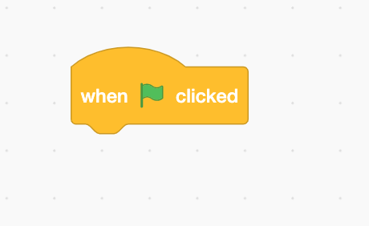
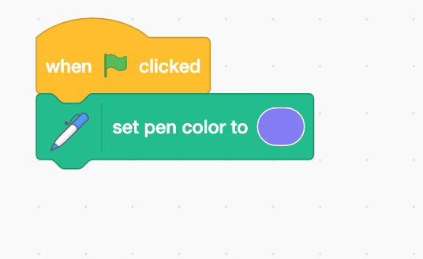
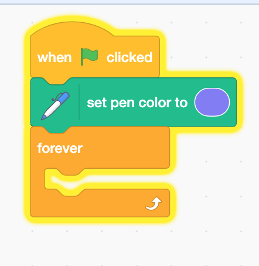
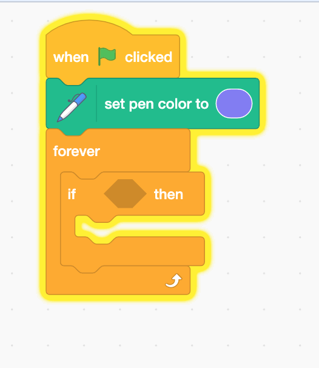
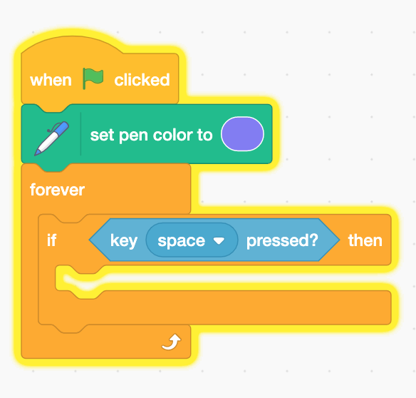
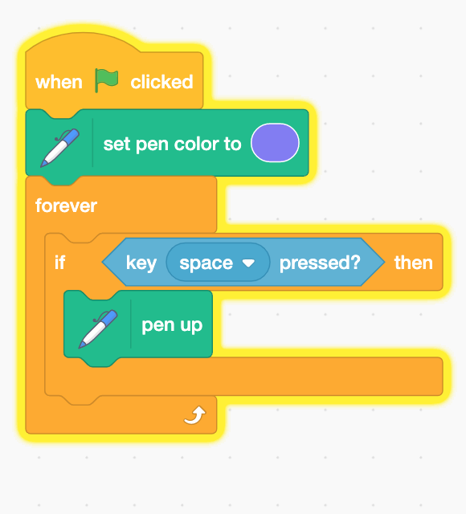
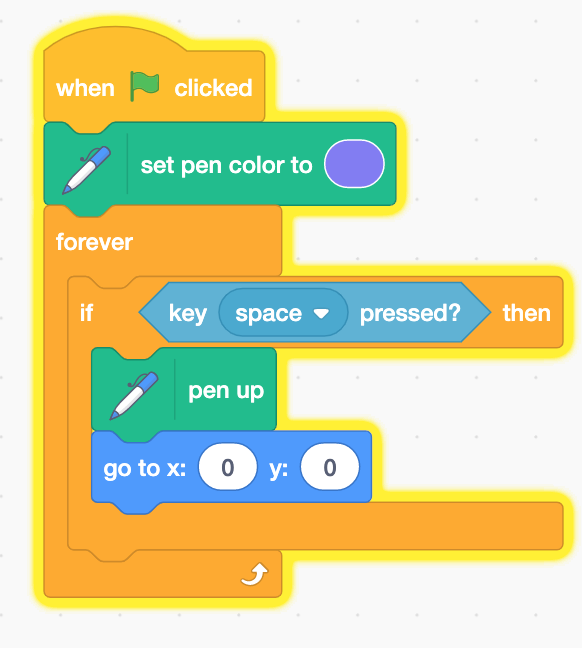
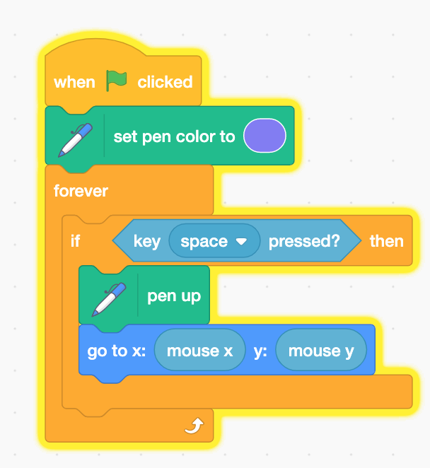
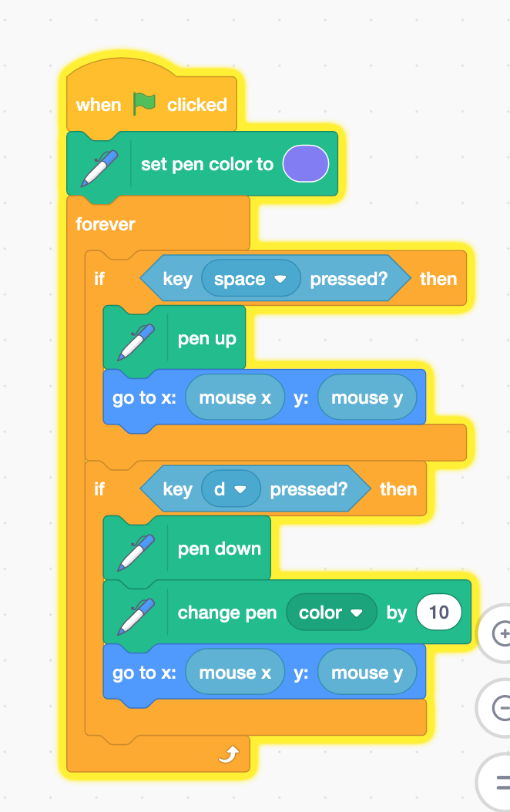

## Scatch Pentool

1. Drag a when a pen green flag clicked block.

2. Connect the set pen color block to the when green flag clicked block.

3. Drag a forever block and connect it to the bottom block.

4. Drag an if block and put it inside the forever block.

5. Go to the sensing menu and drag a when key pressed block and insert that into
   the if block.

6. Go to the pen menu and drag a pen down block and put it inside the if block.

7. Drag a goto block and put it inside the if block.

8. Go to the motion menu and drag an mousex and mousey blocks and put them into
   the goto block.

9. Repeat this except this time use the pen down when you are pressing the d
   key.

